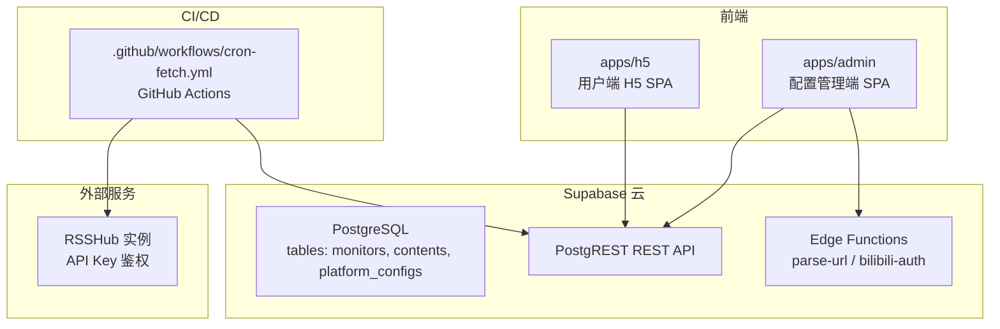
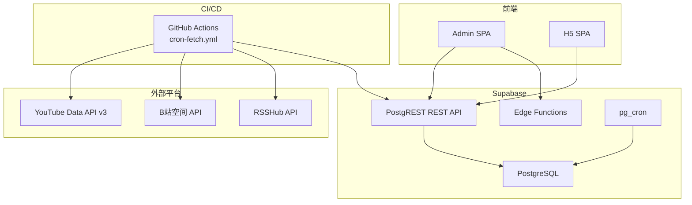
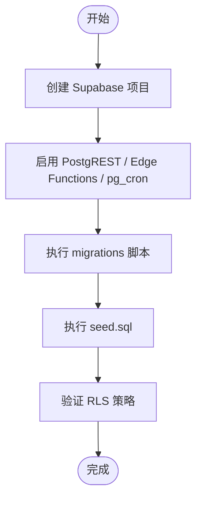
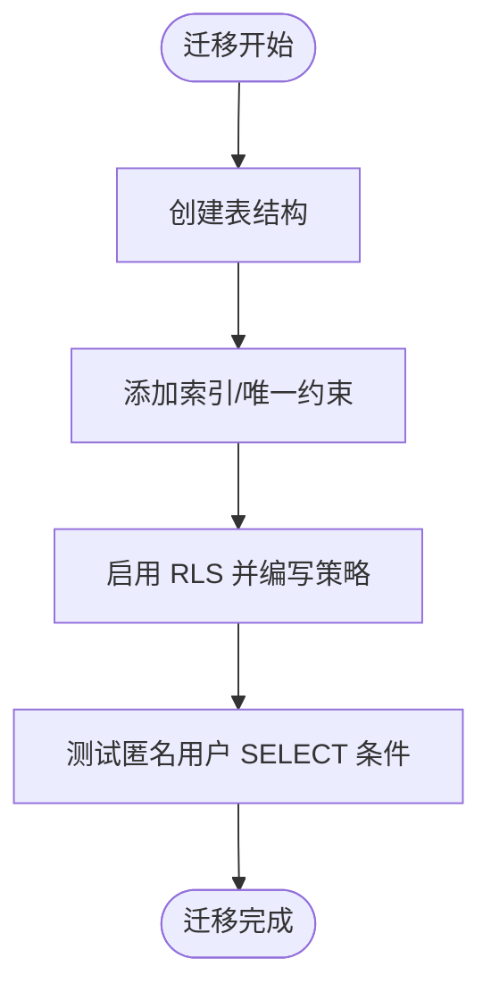
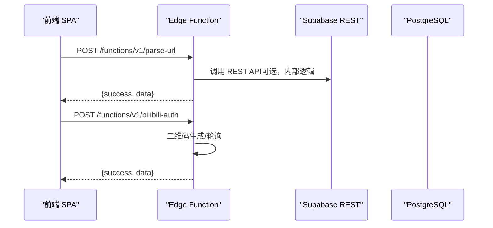
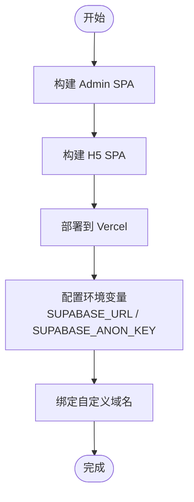
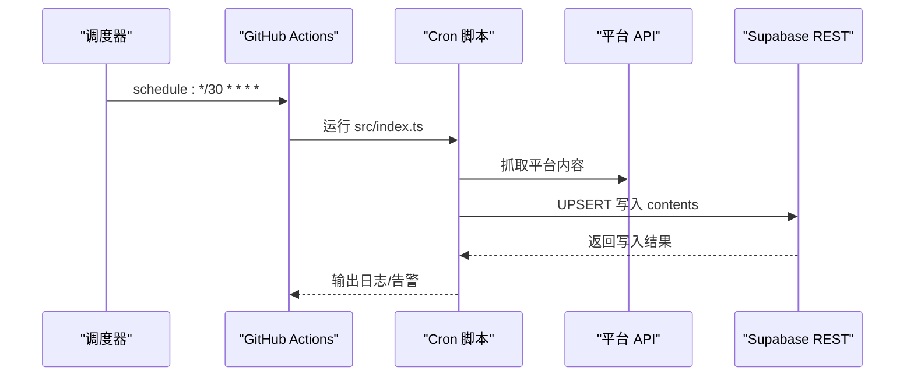
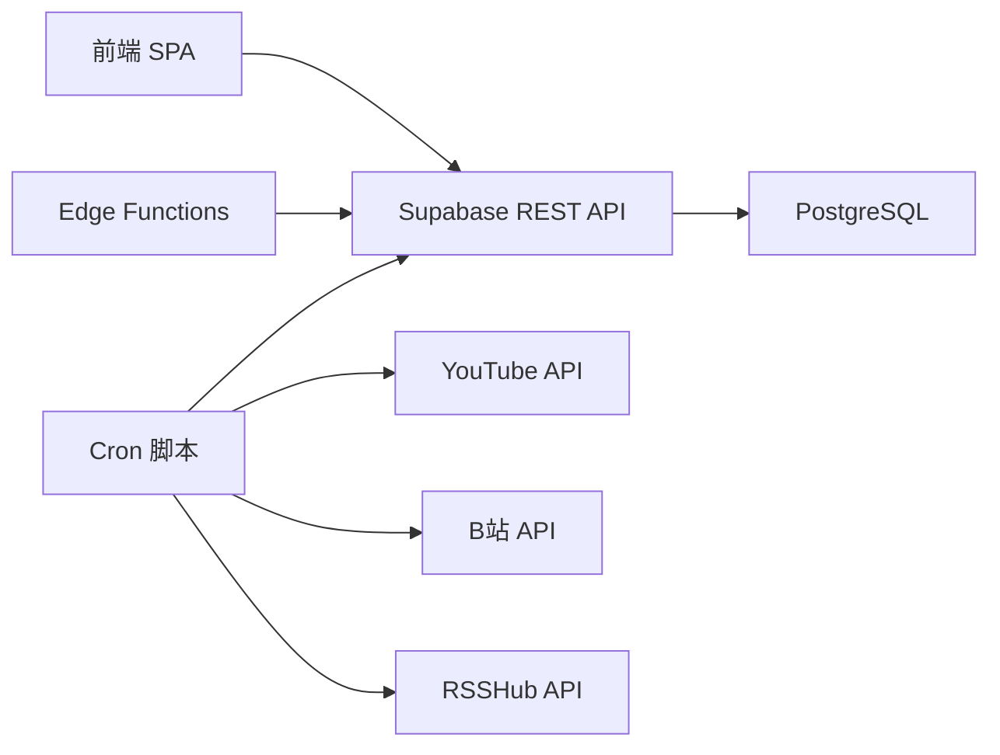

# 部署指南

<cite>
**本文引用的文件**
- [PROJECT_CONTEXT.md](file://PROJECT_CONTEXT.md)
- [多平台中枢_PRD.md](file://多平台中枢_PRD.md)
</cite>

## 目录
1. [简介](#简介)
2. [项目结构](#项目结构)
3. [核心组件](#核心组件)
4. [架构总览](#架构总览)
5. [详细组件分析](#详细组件分析)
6. [依赖分析](#依赖分析)
7. [性能考虑](#性能考虑)
8. [故障排除指南](#故障排除指南)
9. [结论](#结论)
10. [附录](#附录)

## 简介
本指南面向“多平台内容中枢”项目的生产环境部署，覆盖 Supabase 项目初始化与配置、数据库迁移与 RLS 策略、Edge Functions 部署、前端应用（Vercel）部署与域名绑定、GitHub Actions 工作流部署与监控告警、环境变量最佳实践、部署后验证与运维、以及多环境（开发/测试/生产）管理策略。目标是帮助团队以最小风险、可追溯的方式完成端到端上线。

## 项目结构
项目采用 pnpm monorepo，前端应用分为配置管理端与用户端 H5，后端由 Supabase 托管的数据库、PostgREST、Edge Functions 与 GitHub Actions Cron 组成。关键目录与职责如下：
- apps/admin：配置管理端（React SPA）
- apps/h5：用户端 H5（React SPA）
- packages/shared：前后端共享类型与常量
- supabase/functions：Edge Functions（Deno，parse-url、bilibili-auth）
- supabase/migrations：数据库迁移脚本
- scripts/cron：GitHub Actions Cron 脚本（Node.js）
- .github/workflows：CI/CD 工作流（cron-fetch）

图表来源
- [PROJECT_CONTEXT.md:51-142](file://PROJECT_CONTEXT.md#L51-L142)

章节来源
- [PROJECT_CONTEXT.md:51-142](file://PROJECT_CONTEXT.md#L51-L142)

## 核心组件
- Supabase 项目：PostgreSQL + PostgREST + Edge Functions + pg_cron + RLS
- 前端 SPA：Vercel 静态托管，使用 Supabase JS SDK 与 REST API
- Cron 引擎：GitHub Actions 每 30 分钟触发 Node.js 抓取脚本，调用平台 API 并写入 Supabase
- Edge Functions：Deno，负责 URL 解析与 B站扫码授权
- 数据模型：monitors、contents、platform_configs，配合 RLS 与 UPSERT 去重

章节来源
- [PROJECT_CONTEXT.md:8-47](file://PROJECT_CONTEXT.md#L8-L47)
- [PROJECT_CONTEXT.md:169-241](file://PROJECT_CONTEXT.md#L169-L241)

## 架构总览
系统以 Supabase 为核心，前端通过 REST API 与 Edge Functions 与后端交互；Cron 通过 GitHub Actions 调用平台 API，清洗后写入数据库；RSSHub 作为知乎抓取的中转通道。

图表来源
- [PROJECT_CONTEXT.md:169-241](file://PROJECT_CONTEXT.md#L169-L241)
- [PROJECT_CONTEXT.md:615-644](file://PROJECT_CONTEXT.md#L615-L644)

章节来源
- [PROJECT_CONTEXT.md:169-241](file://PROJECT_CONTEXT.md#L169-L241)
- [PROJECT_CONTEXT.md:615-644](file://PROJECT_CONTEXT.md#L615-L644)

## 详细组件分析

### Supabase 初始化与配置
- 创建项目并启用 PostgREST、Edge Functions、pg_cron
- 在 config.toml 中配置项目参数（如数据库公开访问、函数路由等）
- 通过 migrations 目录执行 SQL 脚本，创建表与 RLS 策略
- 在 seed.sql 中准备初始数据（如平台配置、默认监控等）

图表来源
- [PROJECT_CONTEXT.md:107-113](file://PROJECT_CONTEXT.md#L107-L113)

章节来源
- [PROJECT_CONTEXT.md:107-113](file://PROJECT_CONTEXT.md#L107-L113)

### 数据库迁移与 RLS
- 迁移脚本顺序：先创建表，再创建索引/唯一约束，最后启用 RLS 并编写策略
- monitors、contents、platform_configs 均启用 RLS
- contents 表默认仅对匿名用户开放 SELECT 条件：is_display = true

图表来源
- [PROJECT_CONTEXT.md:360-401](file://PROJECT_CONTEXT.md#L360-L401)

章节来源
- [PROJECT_CONTEXT.md:360-401](file://PROJECT_CONTEXT.md#L360-L401)

### Edge Functions 部署（Deno）
- 函数目录：supabase/functions/parse-url、supabase/functions/bilibili-auth
- 共享代码：_shared 目录（下划线前缀，不部署），包含 supabaseAdmin.ts、supabaseClient.ts、cors.ts
- 部署方式：通过 Supabase CLI 或在 Supabase 仪表板上传函数代码
- 访问方式：HTTPS POST，请求体 JSON，响应体 JSON，错误码统一

图表来源
- [PROJECT_CONTEXT.md:475-569](file://PROJECT_CONTEXT.md#L475-L569)

章节来源
- [PROJECT_CONTEXT.md:97-113](file://PROJECT_CONTEXT.md#L97-L113)
- [PROJECT_CONTEXT.md:475-569](file://PROJECT_CONTEXT.md#L475-L569)

### 前端应用部署（Vercel）
- 应用：apps/admin、apps/h5（两个独立 SPA）
- 构建工具：Vite 5
- 配置要点：
  - 环境变量：SUPABASE_URL、SUPABASE_ANON_KEY（在 Vercel 项目设置中配置）
  - 构建命令与输出目录：依据各应用的 package.json 与 vite.config.ts
  - 预览/生产环境区分：通过 Vercel 环境别名与预览部署
  - 域名绑定：在 Vercel 项目设置中添加自定义域名并配置 DNS
- 访问策略：前端仅使用 SUPABASE_ANON_KEY，不暴露 SERVICE_ROLE_KEY

图表来源
- [PROJECT_CONTEXT.md:14-24](file://PROJECT_CONTEXT.md#L14-L24)
- [PROJECT_CONTEXT.md:34-46](file://PROJECT_CONTEXT.md#L34-L46)

章节来源
- [PROJECT_CONTEXT.md:14-24](file://PROJECT_CONTEXT.md#L14-L24)
- [PROJECT_CONTEXT.md:34-46](file://PROJECT_CONTEXT.md#L34-L46)

### GitHub Actions 工作流部署与监控告警
- 工作流：.github/workflows/cron-fetch.yml，每 30 分钟触发一次
- 环境变量：SUPABASE_URL、SUPABASE_SERVICE_ROLE_KEY、YOUTUBE_API_KEY、RSSHUB_URL、RSSHUB_API_KEY、WECOM_WEBHOOK_URL（可选）
- 步骤概览：检出代码、安装 Node.js 与 pnpm、安装依赖、执行 Cron 脚本
- 监控告警：连续失败达到阈值触发企业微信 Webhook 或通知机器人

图表来源
- [PROJECT_CONTEXT.md:615-644](file://PROJECT_CONTEXT.md#L615-L644)

章节来源
- [PROJECT_CONTEXT.md:615-644](file://PROJECT_CONTEXT.md#L615-L644)

### 环境变量配置最佳实践
- 敏感信息：SERVICE_ROLE_KEY、YOUTUBE_API_KEY、B站 Cookie（加密存储）、RSSHUB 凭据、企业微信 Webhook
- 存储位置：
  - 前端公开变量：SUPABASE_URL、SUPABASE_ANON_KEY（Vercel 项目设置）
  - 服务端/脚本变量：SUPABASE_SERVICE_ROLE_KEY、YOUTUBE_API_KEY、RSSHUB_URL、RSSHUB_API_KEY、WECOM_WEBHOOK_URL（GitHub Secrets）
- 命名规范：全大写蛇形（UPPER_SNAKE）
- 最小暴露原则：前端仅使用 ANON_KEY，SERVICE_ROLE_KEY 仅在 CI/Edge Functions 使用

章节来源
- [PROJECT_CONTEXT.md:34-46](file://PROJECT_CONTEXT.md#L34-L46)

### 多环境部署策略（开发/测试/生产）
- 环境隔离：
  - 开发：本地开发环境 + Supabase 开发项目 + Vercel 开发分支/预览
  - 测试：独立 Supabase 测试项目 + Vercel 测试分支
  - 生产：生产 Supabase 项目 + Vercel 生产分支 + 生产域名
- Secrets 管理：各环境使用独立的 GitHub Secrets 与 Vercel 环境变量
- 数据隔离：不同环境使用独立数据库实例与表空间，避免交叉污染
- 变更审批：生产变更通过 Pull Request 与审批流程，结合工作流手动触发

章节来源
- [PROJECT_CONTEXT.md:34-46](file://PROJECT_CONTEXT.md#L34-L46)
- [PROJECT_CONTEXT.md:615-644](file://PROJECT_CONTEXT.md#L615-L644)

## 依赖分析
- 前端依赖 Supabase JS SDK 与 PostgREST REST API
- Cron 脚本依赖 Supabase REST API（Service Role Key）与各平台 API
- Edge Functions 依赖 Deno 运行时与 Supabase Admin Client
- RSSHub 作为知乎抓取中转，需启用 API Key 鉴权

图表来源
- [PROJECT_CONTEXT.md:29-32](file://PROJECT_CONTEXT.md#L29-L32)
- [PROJECT_CONTEXT.md:615-644](file://PROJECT_CONTEXT.md#L615-L644)

章节来源
- [PROJECT_CONTEXT.md:29-32](file://PROJECT_CONTEXT.md#L29-L32)
- [PROJECT_CONTEXT.md:615-644](file://PROJECT_CONTEXT.md#L615-L644)

## 性能考虑
- 前端：Vite 构建优化、按需加载、CDN 加速（Vercel 默认）
- 数据库：合理索引与唯一约束（platform + native_id），RLS 策略尽量简单
- Cron：互斥锁（pg advisory lock 或分布式锁）、同平台请求间隔 ≥ 1.5s、YouTube 4 小时窗口
- API 调用：限速与配额管理（YouTube API 配额），失败重试与降级策略

## 故障排除指南
- 前端无法加载数据
  - 检查 SUPABASE_URL 与 SUPABASE_ANON_KEY 是否正确配置
  - 检查 RLS 策略是否正确（匿名用户仅能读 is_display=true 的记录）
- Edge Functions 报错
  - 检查函数日志与错误码（如 UNKNOWN_PLATFORM、INVALID_URL、B站 Cookie 失效等）
  - 确认函数依赖的环境变量与 Supabase 连接
- Cron 抓取失败
  - 检查 SERVICE_ROLE_KEY、平台 API Key、RSSHub 凭据
  - 查看工作流日志，定位失败原因（网络、配额、Cookie 失效）
- 域名访问异常
  - 检查 DNS 解析与证书状态，确认 Vercel 自定义域名配置生效

章节来源
- [PROJECT_CONTEXT.md:600-614](file://PROJECT_CONTEXT.md#L600-L614)
- [PROJECT_CONTEXT.md:615-644](file://PROJECT_CONTEXT.md#L615-L644)

## 结论
通过本指南，团队可在生产环境中以 Supabase 为核心、Vercel 为前端托管、GitHub Actions 为自动化引擎，完成从数据库初始化、迁移与 RLS、Edge Functions 部署，到前端应用与域名绑定、工作流与监控告警的完整部署闭环。建议严格遵循环境变量安全策略与多环境管理规范，持续完善监控与告警体系，保障系统稳定运行。

## 附录
- 环境变量清单与用途参考：[PROJECT_CONTEXT.md:34-46](file://PROJECT_CONTEXT.md#L34-L46)
- 工作流配置参考：[PROJECT_CONTEXT.md:615-644](file://PROJECT_CONTEXT.md#L615-L644)
- 数据模型与 RLS 策略参考：[PROJECT_CONTEXT.md:327-401](file://PROJECT_CONTEXT.md#L327-L401)