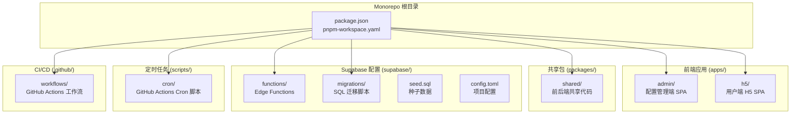
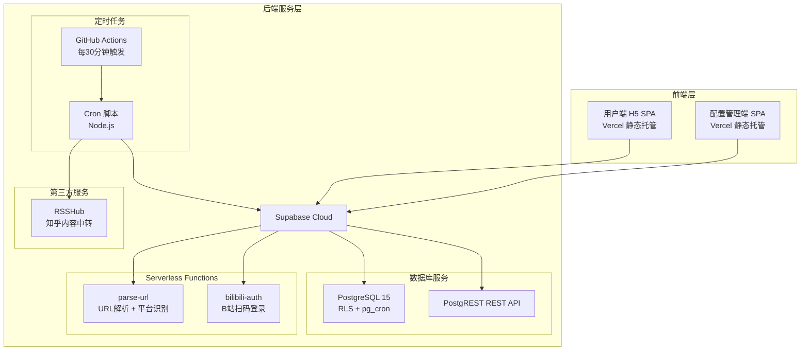
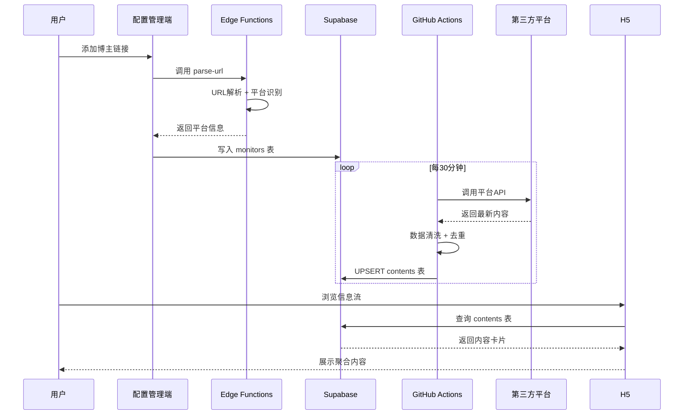
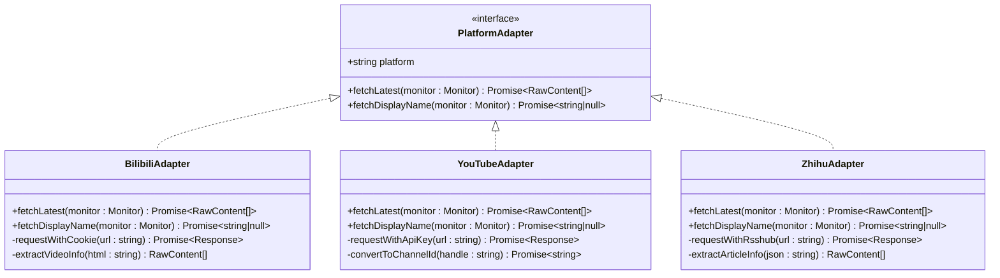
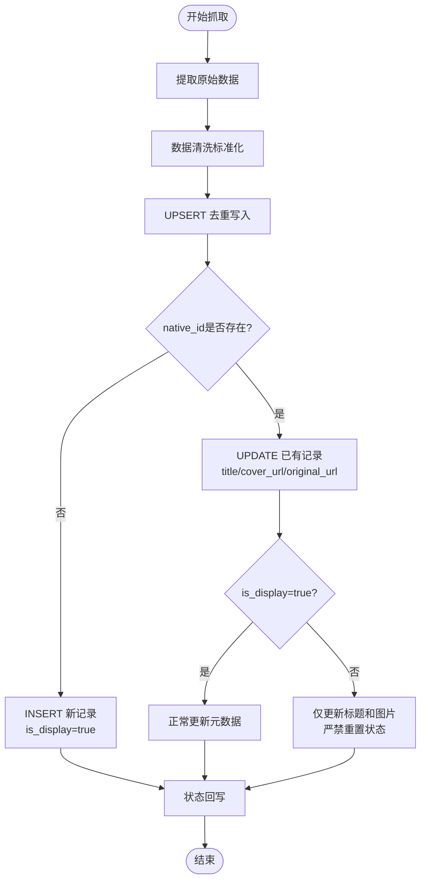
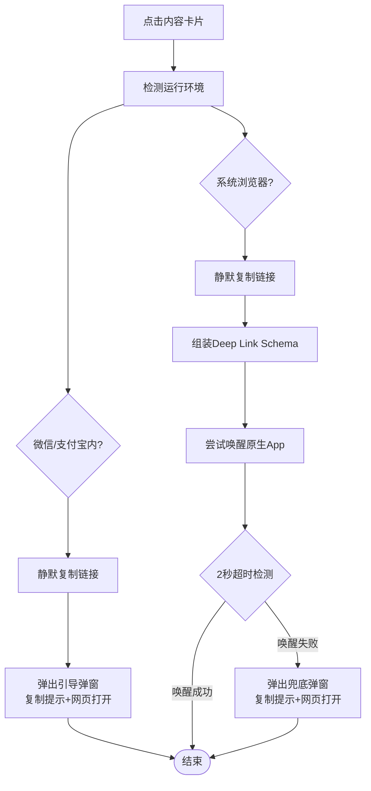

# 项目概述

<cite>
**本文档引用的文件**
- [PROJECT_CONTEXT.md](file://PROJECT_CONTEXT.md)
- [多平台中枢_PRD.md](file://多平台中枢_PRD.md)
</cite>

## 目录
1. [简介](#简介)
2. [项目结构](#项目结构)
3. [核心组件](#核心组件)
4. [架构总览](#架构总览)
5. [详细组件分析](#详细组件分析)
6. [依赖关系分析](#依赖关系分析)
7. [性能考虑](#性能考虑)
8. [故障排除指南](#故障排除指南)
9. [结论](#结论)
10. [附录](#附录)

## 简介

多平台内容中枢（Content Hub）是一个配置驱动的多平台内容聚合系统，旨在帮助用户在一个页面内追踪抖音、B站、知乎、YouTube四个平台上关注的博主最新内容。该项目采用现代化的全栈架构，结合Monorepo组织方式、Serverless部署和定时任务调度，为用户提供轻量、高效、可扩展的内容聚合解决方案。

### 核心价值主张

**一站式内容聚合体验**：用户无需在4个不同App之间反复切换，只需在一个H5页面即可浏览所有关注博主的最新内容，时间线按发布时间倒序统一呈现。

**原生应用深度体验**：系统支持Deep Link协议，点击内容卡片可直接唤醒原生App进行深度阅读/观看，提升用户体验。

**智能中转与版权尊重**：系统不存储视频/文章正文，仅保存信息卡片（标题、封面、链接），所有阅读行为回到原平台完成，既保持系统极轻量，又尊重内容平台的版权。

**配置驱动的自动化**：通过配置管理端，用户可以轻松添加、管理和监控各个平台的关注对象，系统自动完成内容抓取、清洗和展示。

### 目标用户群体

**多平台重度内容消费者**：日常同时关注抖音、B站、知乎、YouTube上20-100位创作者，每天花费15-60分钟在不同App之间切换查看更新的用户。

**个人/小团队运营者**：需要监控竞品或行业KOL在多个平台上的发布动态，要求轻量、低成本、无需复杂部署的专业用户。

**技术爱好者**：对Serverless架构、Monorepo组织方式、定时任务调度等现代技术栈感兴趣的技术用户。

### 解决的核心问题

- **内容分散问题**：四大平台各自拥有独立的推荐算法，用户需要在4个App之间反复切换才能看完所有更新
- **追踪效率问题**：手动刷4个App耗时、容易漏看，缺乏统一的时间线视图
- **体验割裂问题**：某些平台推荐算法"吞掉"了关注博主的内容，需要绕过算法推荐
- **技术门槛问题**：RSSHub自建复杂，第三方聚合App功能过重或不支持特定平台

## 项目结构

项目采用pnpm workspace管理的Monorepo架构，基于Supabase官方推荐的Edge Functions组织方式和前端社区主流的apps/packages分层模式。



**图表来源**
- [PROJECT_CONTEXT.md:51-141](file://PROJECT_CONTEXT.md#L51-L141)

### 目录规范与命名约定

项目建立了完善的目录规范和命名约定，确保代码的一致性和可维护性：

- **Edge Function**：使用连字符（kebab-case），URL友好，如`parse-url`、`bilibili-auth`
- **数据库表/字段**：使用蛇形（snake_case），如`monitors`、`is_active`、`last_sync_at`
- **TypeScript 文件**：使用连字符（kebab-case），如`deep-link.ts`、`platform-configs.ts`
- **React 组件**：使用帕斯卡（PascalCase），如`MonitorList`、`ContentCard`
- **常量**：使用全大写蛇形（UPPER_SNAKE），如`PLATFORM_COLORS`、`MAX_CONTENT_AGE_DAYS`

### 共享类型同步策略

`packages/shared`作为前后端类型的唯一数据源（Single Source of Truth），通过workspace依赖在前端（`apps/admin`、`apps/h5`）和Cron脚本（`scripts/cron`）中共享使用。对于Edge Functions（Deno环境），通过手动保持类型同步，在`_shared/types.ts`中维护副本并标注`// SYNC: packages/shared/src/types/`。

**章节来源**
- [PROJECT_CONTEXT.md:49-166](file://PROJECT_CONTEXT.md#L49-L166)

## 核心组件

### 配置管理端（管理员使用）

配置管理端是系统的管理界面，采用React 18 + TypeScript构建的独立SPA应用，提供完整的监控目标管理功能。

**核心功能**：
- **统一添加入口**：顶部通用输入框支持粘贴任意平台博主主页链接，自动识别平台并解析唯一标识
- **平台自动识别与解析**：根据URL特征自动识别平台并提取核心标识，支持抖音、B站、知乎、YouTube四种平台
- **监控状态面板**：展示每个博主的最后同步时间、运行状态（正常/Cookie过期/接口受限）和活跃度提示
- **昵称管理**：支持同步获取和行内编辑博主昵称，管理员修改后不再自动覆盖

**技术实现**：
- 前端直接调用Supabase REST API进行CRUD操作
- 添加时调用`parse-url` Edge Function解析平台与标识
- 支持批量操作和状态控制

### 后端自动化引擎

后端自动化引擎是系统的核心执行层，负责定时轮询、数据抓取、清洗标准化和去重处理。

**核心功能**：
- **定时轮询机制**：每30分钟执行一次，基于数据库互斥锁确保并发安全
- **平台适配器层**：统一抽象B站、YouTube、知乎等平台的抓取逻辑
- **数据清洗标准化**：将不同平台的原始数据结构统一为标准信息卡片模型
- **UPSERT去重**：基于`(platform, native_id)`唯一索引的去重写入，防止旧数据复活
- **软删除生命周期**：每日凌晨执行软删除任务，保留30天内内容的历史轨迹

**技术特色**：
- **配置驱动**：通过`platform_configs`表配置各平台的抓取参数和认证信息
- **并发安全**：基于PostgreSQL咨询锁实现Cron互斥，避免重复执行
- **限速保护**：同平台请求间隔≥1.5秒，YouTube专属4小时限频保护
- **异常告警**：连续失败≥3次触发企业微信告警通知

### 用户端H5（日常浏览使用）

用户端H5是系统的日常浏览界面，采用React SPA构建，提供聚合信息流展示和一键跳转功能。

**核心功能**：
- **聚合信息流**：按发布时间倒序展示所有内容卡片，支持无限滚动分页加载
- **平台筛选**：顶栏Tab切换支持按平台筛选（全部/抖音/B站/知乎/YouTube）
- **Deep Link跳转**：根据`(platform, content_type)`组合选择Schema唤醒原生App
- **兜底弹窗**：跳转失败时提供复制链接+网页打开的兜底方案

**用户体验**：
- 每张卡片展示封面图、标题、平台彩色Tag和发布时间
- 平台Tag配色规范：抖音黑色、B站粉色、知乎蓝色、YouTube红色
- 支持微信内环境检测，自动切换跳转策略

**章节来源**
- [PROJECT_CONTEXT.md:243-271](file://PROJECT_CONTEXT.md#L243-L271)
- [多平台中枢_PRD.md:100-294](file://多平台中枢_PRD.md#L100-L294)

## 架构总览

系统采用分层架构设计，通过Supabase Cloud提供基础设施服务，结合Serverless部署和定时任务调度，实现高可用、可扩展的内容聚合服务。



**图表来源**
- [PROJECT_CONTEXT.md:169-207](file://PROJECT_CONTEXT.md#L169-L207)

### 核心架构约束

系统遵循严格的安全和性能约束，确保服务的可靠性：

- **前端不直接调用第三方平台API**：所有平台API调用都在GitHub Actions Cron脚本内完成
- **Cron脚本不直接操作数据库连接**：通过Supabase REST API（Service Role Key）写入数据
- **Edge Functions仅用于轻量逻辑**：URL解析、B站扫码登录等，数据密集型操作使用PostgREST
- **Service Role Key永不暴露到前端**：仅存储在GitHub Secrets中
- **RSSHub必须启用API Key鉴权**：通过`ACCESS_CONTROL`配置项限制访问

### 数据流架构



**图表来源**
- [PROJECT_CONTEXT.md:224-239](file://PROJECT_CONTEXT.md#L224-L239)

**章节来源**
- [PROJECT_CONTEXT.md:169-240](file://PROJECT_CONTEXT.md#L169-L240)

## 详细组件分析

### 平台适配器层

平台适配器层是后端自动化引擎的核心抽象，统一处理不同平台的内容抓取逻辑。



**图表来源**
- [PROJECT_CONTEXT.md:301-317](file://PROJECT_CONTEXT.md#L301-L317)

#### 技术特色

- **统一接口抽象**：所有适配器实现相同的`PlatformAdapter`接口，便于扩展新平台
- **差异化实现**：针对不同平台的特点采用不同的认证方式和限速策略
- **错误处理**：每个适配器都有完善的错误处理和降级策略

#### 平台特性对比

| 适配器 | 数据源 | 鉴权方式 | 限速策略 | 特殊处理 |
|--------|--------|----------|----------|----------|
| B站 | 空间API `x/space/wbi/arc/search` | Cookie (SESSDATA) | 同平台≥1.5s | 需要定期更新Cookie |
| YouTube | `playlistItems.list` (uploads playlist) | API Key | 无需额外限速 | 4小时专属限频 |
| 知乎 | RSSHub HTTP接口 | API Key | 同平台≥1.5s | 反爬严格，支持中转 |

**章节来源**
- [PROJECT_CONTEXT.md:301-317](file://PROJECT_CONTEXT.md#L301-L317)

### 数据去重与UPSERT机制

系统采用基于`(platform, native_id)`唯一索引的UPSERT去重机制，确保数据一致性并防止旧数据复活。



**图表来源**
- [PROJECT_CONTEXT.md:318-334](file://PROJECT_CONTEXT.md#L318-L334)

#### 防复活保护机制

系统实现了严密的防复活保护，确保软删除的记录不会被意外重置：

- **状态保护**：`is_display=false`的记录严禁重置为`true`
- **时间保护**：`created_at`时间严禁被重置为新时间
- **元数据保护**：仅允许更新标题和封面链接，防止死链和破损图片

**章节来源**
- [PROJECT_CONTEXT.md:318-334](file://PROJECT_CONTEXT.md#L318-L334)

### Deep Link跳转机制

系统实现了智能的Deep Link跳转机制，支持在不同环境下选择最优的跳转策略。



**图表来源**
- [多平台中枢_PRD.md:789-898](file://多平台中枢_PRD.md#L789-L898)

#### 平台支持范围

| 平台 | content_type | Deep Link Schema | 网页兜底 |
|------|--------------|------------------|----------|
| B站 | video | `bilibili://video/{native_id}` | `original_url` |
| B站 | article | `bilibili://article/{native_id}` | `original_url` |
| YouTube | video | `youtube://watch?v={native_id}` | `original_url` |
| 知乎 | * | **不支持 Deep Link** | 直接 `original_url` |

**章节来源**
- [多平台中枢_PRD.md:258-294](file://多平台中枢_PRD.md#L258-L294)

## 依赖关系分析

系统采用了现代化的技术栈组合，通过合理的依赖管理确保架构的清晰性和可维护性。

```mermaid
graph TB
subgraph "前端技术栈"
React[React 18 + TypeScript]
Vite[Vite 5]
Tailwind[Tailwind CSS 3]
SupabaseJS[@supabase/supabase-js]
end
subgraph "后端技术栈"
SupabaseCloud[Supabase Cloud]
Deno[Deno + TypeScript]
PostgREST[PostgREST]
PostgreSQL[PostgreSQL 15]
end
subgraph "基础设施"
Vercel[Vercel 静态托管]
GitHubActions[GitHub Actions]
RSSHub[RSSHub 容器]
end
subgraph "包管理"
PNPM[pnpm + workspace]
Monorepo[Monorepo 架构]
end
React --> SupabaseJS
React --> Vite
React --> Tailwind
SupabaseJS --> SupabaseCloud
Deno --> SupabaseCloud
PostgREST --> PostgreSQL
Vercel --> React
GitHubActions --> RSSHub
PNPM --> Monorepo
```

**图表来源**
- [PROJECT_CONTEXT.md:8-24](file://PROJECT_CONTEXT.md#L8-L24)

### 关键依赖关系

**前端与后端通信**：
- 前端SPA通过`@supabase/supabase-js`与Supabase Cloud交互
- Edge Functions使用Deno环境的`@supabase/supabase`模块
- Cron脚本同样使用`@supabase/supabase-js`进行数据写入

**数据流依赖**：
- GitHub Actions Cron脚本依赖第三方平台API（B站Cookie、YouTube API Key、RSSHub）
- Edge Functions依赖Supabase Cloud提供的函数执行环境
- 前端应用依赖Vercel的静态托管服务

**安全依赖**：
- Supabase RLS策略保护数据库访问
- Service Role Key仅在后端环境中使用
- 敏感信息通过环境变量和Supabase Vault管理

**章节来源**
- [PROJECT_CONTEXT.md:25-46](file://PROJECT_CONTEXT.md#L25-L46)

## 性能考虑

系统在设计时充分考虑了性能优化，通过多种技术手段确保服务的高效运行。

### 前端性能优化

- **静态资源优化**：Vite提供快速HMR和生产构建优化，减少打包体积
- **原子化CSS**：Tailwind CSS实现按需加载，避免不必要的样式代码
- **客户端渲染**：纯客户端渲染减少服务端压力，适合Vercel静态托管
- **无限滚动**：分页加载每页20条内容，平衡加载速度和内存占用

### 后端性能优化

- **Serverless架构**：Deno Edge Functions按需执行，避免常驻进程开销
- **数据库优化**：PostgreSQL原生咨询锁实现Cron互斥，避免重复执行
- **缓存策略**：前端SPA本地缓存常用数据，减少重复请求
- **并发控制**：同平台请求间隔≥1.5秒，防止触发平台频率限制

### 数据库性能优化

- **索引设计**：`(platform, native_id)`唯一索引支持快速去重
- **分区策略**：按时间分区存储内容，优化查询性能
- **软删除机制**：通过`is_display`字段实现逻辑删除，避免物理删除开销
- **批量操作**：UPSERT操作减少单条插入的开销

## 故障排除指南

### 常见问题与解决方案

**B站Cookie过期**
- 症状：抓取失败，状态变为"Cookie过期"
- 解决方案：重新执行`bilibili-auth` Edge Function获取新的Cookie
- 预防措施：定期检查Cookie有效期，设置自动更新机制

**YouTube API配额用尽**
- 症状：适配器请求返回403 quotaExceeded
- 解决方案：等待24小时配额重置，或增加API Key
- 预防措施：合理安排抓取频率，利用4小时专属限频保护

**知乎反爬触发验证码**
- 症状：适配器请求失败，返回验证码
- 解决方案：检查RSSHub实例状态，确保API Key鉴权正常
- 预防措施：配置动态Cookie或使用RSSHub中转

**微信内Deep Link失败**
- 症状：点击卡片无法唤醒原生App
- 解决方案：系统自动切换到复制链接+引导弹窗模式
- 用户指导：长按右上角···→在浏览器中打开

### 监控与告警

系统实现了完善的监控和告警机制：

- **连续失败告警**：fail_count≥3触发企业微信告警通知
- **状态可视化**：配置管理端实时显示每个博主的运行状态
- **日志记录**：详细的执行日志便于问题排查
- **健康检查**：定期检查各组件运行状态

**章节来源**
- [多平台中枢_PRD.md:928-951](file://多平台中枢_PRD.md#L928-L951)

## 结论

多平台内容中枢项目通过创新的配置驱动抓取模式，成功解决了多平台内容聚合的核心痛点。项目采用现代化的全栈技术栈，结合Monorepo架构、Serverless部署和定时任务调度，为用户提供了轻量、高效、可扩展的内容聚合解决方案。

### 技术优势总结

**架构创新**：
- 配置驱动的自动化内容抓取，无需用户深入了解底层技术细节
- Serverless架构实现弹性扩展，降低运维成本
- Monorepo组织方式确保前后端代码的一致性和可维护性

**用户体验优化**：
- 一键跳转原生App，提供沉浸式阅读体验
- 智能环境检测，自动选择最优跳转策略
- 聚合信息流展示，统一时间线视图

**技术可靠性**：
- 完善的安全机制，保护敏感信息和用户隐私
- 严格的错误处理和降级策略，确保服务稳定性
- 可扩展的架构设计，支持未来平台扩展

### 未来发展展望

项目已制定了清晰的发展路线图，从基础闭环到多平台覆盖，再到体验优化和功能扩展。随着技术的不断演进和用户需求的增长，系统将继续完善功能、优化性能，为用户提供更加优质的多平台内容聚合服务。

## 附录

### 环境变量配置

系统通过环境变量管理敏感配置信息，确保安全性和灵活性：

| 变量名 | 存储位置 | 用途说明 |
|--------|----------|----------|
| `SUPABASE_URL` | Vercel / GitHub Secrets | Supabase项目URL |
| `SUPABASE_ANON_KEY` | Vercel | 前端公开使用，受RLS保护 |
| `SUPABASE_SERVICE_ROLE_KEY` | GitHub Secrets | 绕过RLS，仅Cron和Edge Function使用 |
| `YOUTUBE_API_KEY` | GitHub Secrets | YouTube Data API v3密钥 |
| `BILIBILI_COOKIE_*` | Supabase数据库（加密） | B站Cookie，扫码登录后存储 |
| `RSSHUB_URL` | GitHub Secrets | RSSHub实例地址 |
| `RSSHUB_API_KEY` | GitHub Secrets | RSSHub访问鉴权密钥 |
| `WECOM_WEBHOOK_URL` | GitHub Secrets（可选） | 企业微信告警Webhook |

### 数据库表结构

系统采用简洁高效的数据模型设计：

**monitors表**：存储监控目标信息
- 主键：`id`（自增）
- 唯一标识：`(platform, native_id)`
- 状态字段：`is_active`、`status`、`fail_count`
- 时间字段：`created_at`、`last_sync_at`、`last_content_at`

**contents表**：存储内容信息卡片
- 主键：`id`（自增）
- 唯一标识：`(platform, native_id)`
- 展示控制：`is_display`（软删除）
- 关联字段：`monitor_id`（外键）

**章节来源**
- [PROJECT_CONTEXT.md:349-417](file://PROJECT_CONTEXT.md#L349-L417)